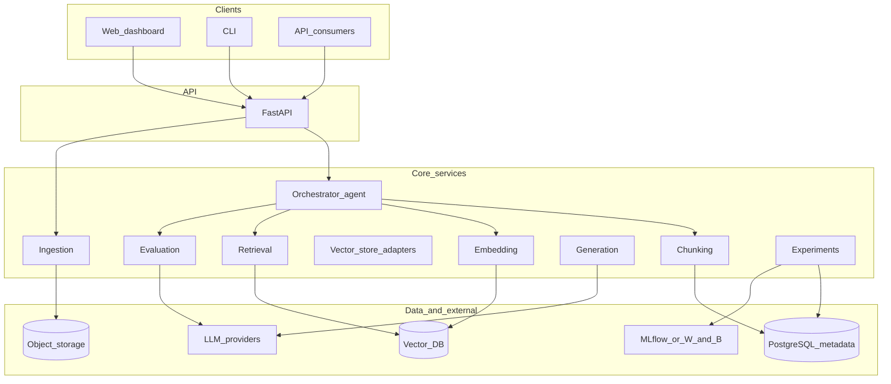
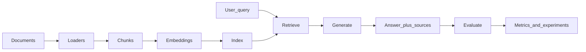

# VertexOps — System Architecture

> **Specification:** Target architecture aligned with [CLAUDE.md](../CLAUDE.md) and [PRD.md](PRD.md). Repository layout may evolve during implementation.

---

## 1. Logical layers



- **Clients:** Optional React+Vite dashboard, CLI, and external integrators share the same **FastAPI** contracts.
- **Orchestrator:** Decides strategies, runs experiments, drives optimization loop; may use LangGraph for stateful workflows.
- **Pipeline modules:** Ingestion → chunking → embedding → indexing; query path: retrieval → generation.
- **Evaluation:** Batch or async jobs producing metrics and artifacts; results linked to experiments.
- **Persistence:** PostgreSQL holds metadata, lineage, experiments; vector DB holds embeddings; object storage holds raw documents and large artifacts.

---

## 2. End-to-end data flow



---

## 3. Prescriptive repository layout

The following is a **recommended** layout; adjust names to match the codebase as it grows.

```
project_root/
├── src/ or backend/           # Application root (choose one convention)
│   ├── api/                   # FastAPI routers, dependencies
│   ├── core/                  # Settings, logging, security, exceptions, middleware
│   ├── ingestion/             # Loaders, parsers, OCR, dedup
│   ├── chunking/              # Strategy implementations
│   ├── embedding/             # Provider adapters
│   ├── vector_store/          # Chroma, Pinecone, Qdrant, etc.
│   ├── retrieval/             # Hybrid, fusion, rerank, MMR
│   ├── generation/            # LLM clients, prompts, budgeting
│   ├── evaluation/            # Datasets, metrics, RAGAS integration
│   ├── orchestration/         # AutoRAG agent, optimization loop
│   ├── experiments/           # Run registry, MLflow/W&B bridges
│   ├── workers/               # Optional Celery tasks
│   └── models/ / repositories/  # ORM + data access if using SQLAlchemy
├── alembic/                   # If PostgreSQL is used
├── tests/
├── web/ or frontend/          # Optional Vite + React dashboard
├── docker-compose.yml
├── Dockerfile(s)
├── k8s/                       # Optional Kubernetes manifests
├── terraform/                 # Optional multi-cloud IaC
└── docs/                      # PRD, API_SPEC, this file, etc.
```

---

## 4. Async and long-running work

- **Synchronous API:** health, lightweight status, query when indexes are warm.
- **Background jobs:** bulk ingest, full re-embed, index rebuild, large eval sweeps — via Celery (or RQ) queues named by concern (`ingest`, `embed`, `eval`) per [DEPLOYMENT.md](DEPLOYMENT.md).
- **Idempotency:** document `content_hash`, experiment `config_hash`, and index **namespace/version** to allow safe retries.

---

## 5. External integrations

| Integration | Role |
|-------------|------|
| LLM APIs | Answer generation, synthetic data, judges (Vertex AI and compatible providers) |
| Embedding APIs / local models | Vectorization |
| Vector database | Similarity search and metadata filters |
| Object storage | Raw files, exported reports |
| MLflow / W&B | Params, metrics, artifacts |
| Prometheus / OTel | Ops metrics and tracing |

---

## 6. Cross-cutting concerns

- **Auth:** JWT and/or API keys; workspace scoping when multi-tenant features exist.
- **Rate limiting:** Redis or in-memory fallback per [PRD.md](PRD.md) security section.
- **Observability:** Structured logs; `/metrics` optional; trace IDs across API and workers.

---

## 7. Related documents

- [PRD.md](PRD.md) — requirements and roadmap
- [API_SPEC.md](API_SPEC.md) — HTTP API
- [DB_SCHEMA.md](DB_SCHEMA.md) — relational metadata
- [DEPLOYMENT.md](DEPLOYMENT.md) — operations
- [HDL.md](HDL.md), [LDL.md](LDL.md) — design views
- [CLAUDE.md](../CLAUDE.md) — full feature specification
