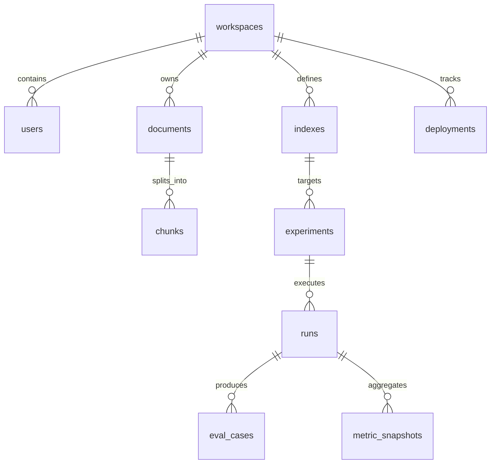

# VertexOps — Database Schema (Metadata)

> **Specification:** Relational schema for **metadata and lineage**. **Embedding vectors** live in the configured **vector database** (Vertex Matching Engine or compatible vector backends), not in PostgreSQL unless an explicit design choice is documented.

**Engine:** PostgreSQL 16+ recommended. **ORM:** SQLAlchemy 2.0 with Alembic migrations when this stack is used.

---

## 1. High-level ER diagram

---

## 2. Core tables (prescriptive)

### 2.1 `workspaces` (optional multi-tenant boundary)

| Column | Type | Notes |
|--------|------|------|
| `id` | UUID PK | |
| `name` | VARCHAR(255) | |
| `created_at`, `updated_at` | TIMESTAMPTZ | |

### 2.2 `users`

| Column | Type | Notes |
|--------|------|------|
| `id` | UUID PK | |
| `workspace_id` | UUID FK → workspaces | nullable if single-tenant MVP |
| `email` | VARCHAR(255) UNIQUE | |
| `password_hash` | VARCHAR(255) | if password auth |
| `role` | VARCHAR(64) | e.g. `admin`, `member`, `api` |
| `created_at`, `updated_at` | TIMESTAMPTZ | |

### 2.3 `documents`

| Column | Type | Notes |
|--------|------|------|
| `id` | UUID PK | |
| `workspace_id` | UUID FK | |
| `title` | VARCHAR(500) | |
| `source_uri` | TEXT | storage key or URL |
| `format` | VARCHAR(32) | pdf, docx, txt, md, html, csv |
| `language` | VARCHAR(16) | detected or declared |
| `content_hash` | VARCHAR(128) | dedup |
| `ingest_status` | VARCHAR(32) | pending, processing, ready, failed |
| `metadata` | JSONB | extracted fields |
| `created_at`, `updated_at` | TIMESTAMPTZ | |

Indexes: `(workspace_id)`, `(content_hash)`, `(ingest_status)`.

### 2.4 `chunks`

| Column | Type | Notes |
|--------|------|------|
| `id` | UUID PK | |
| `document_id` | UUID FK → documents ON DELETE CASCADE | |
| `chunk_index` | INTEGER | order within document |
| `text` | TEXT | or pointer to blob if very large |
| `token_count` | INTEGER | optional |
| `section_path` | VARCHAR(1024) | optional markdown header path |
| `vector_id` | VARCHAR(255) | id in vector DB for this index version |
| `created_at` | TIMESTAMPTZ | |

Indexes: `(document_id)`, `(vector_id)`.

### 2.5 `indexes`

| Column | Type | Notes |
|--------|------|------|
| `id` | UUID PK | |
| `workspace_id` | UUID FK | |
| `name` | VARCHAR(255) | human-readable |
| `vector_backend` | VARCHAR(64) | chroma, pinecone, qdrant, … |
| `namespace` | VARCHAR(255) | provider-specific namespace |
| `config_hash` | VARCHAR(128) | chunking + embed + retrieval defaults |
| `config` | JSONB | full config snapshot |
| `status` | VARCHAR(32) | building, ready, failed |
| `created_at`, `updated_at` | TIMESTAMPTZ | |

### 2.6 `experiments`

| Column | Type | Notes |
|--------|------|------|
| `id` | UUID PK | |
| `workspace_id` | UUID FK | |
| `index_id` | UUID FK → indexes | nullable if experiment pre-index |
| `name` | VARCHAR(255) | |
| `description` | TEXT | |
| `config` | JSONB | hyperparameters, strategy flags |
| `created_at`, `updated_at` | TIMESTAMPTZ | |

### 2.7 `runs`

| Column | Type | Notes |
|--------|------|------|
| `id` | UUID PK | |
| `experiment_id` | UUID FK → experiments ON DELETE CASCADE | |
| `status` | VARCHAR(32) | queued, running, succeeded, failed |
| `started_at`, `finished_at` | TIMESTAMPTZ | |
| `artifact_uri` | TEXT | MLflow run id, W&B run, or object path |
| `logs` | JSONB | optional summary |

### 2.8 `eval_cases` (optional normalized storage)

| Column | Type | Notes |
|--------|------|------|
| `id` | UUID PK | |
| `run_id` | UUID FK → runs | |
| `question` | TEXT | |
| `ground_truth` | TEXT | |
| `predicted` | TEXT | |
| `metrics` | JSONB | per-case scores |
| `failure_type` | VARCHAR(64) | retrieval_miss, hallucination, … |

### 2.9 `metric_snapshots`

| Column | Type | Notes |
|--------|------|------|
| `id` | UUID PK | |
| `run_id` | UUID FK → runs | |
| `metrics` | JSONB | aggregated |
| `created_at` | TIMESTAMPTZ | |

### 2.10 `deployments` (optional)

| Column | Type | Notes |
|--------|------|------|
| `id` | UUID PK | |
| `workspace_id` | UUID FK | |
| `index_id` | UUID FK | |
| `environment` | VARCHAR(32) | dev, staging, prod |
| `revision` | VARCHAR(64) | image git sha, chart version |
| `status` | VARCHAR(32) | |
| `created_at` | TIMESTAMPTZ | |

---

## 3. Vector payload storage

- Store **embeddings** and **ANN indexes** in the vector database.
- PostgreSQL stores **pointers** (`vector_id`, `namespace`, `index.config`) and business metadata for joins and audit.

---

## 4. Related documents

- [ARCHITECTURE.md](ARCHITECTURE.md)
- [API_SPEC.md](API_SPEC.md)
- [PRD.md](PRD.md)
- [CLAUDE.md](../CLAUDE.md)
