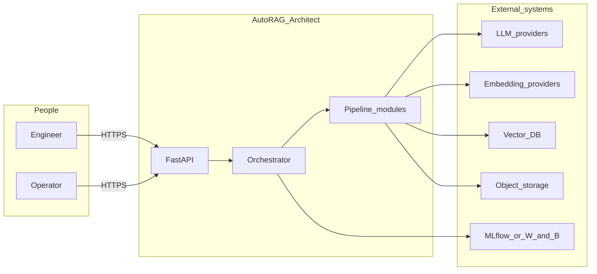

# VertexOps — High-Level Design (HDL)

> **Specification:** Scope, actors, logical components, and deployment topology for **VertexOps**, aligned with [CLAUDE.md](../CLAUDE.md), [PRD.md](PRD.md), and [ARCHITECTURE.md](ARCHITECTURE.md). This is a target design; the repository may implement subsets incrementally.

---

## 1. Purpose and scope

**VertexOps** provides:

- **Document ingestion and processing** for knowledge corpora (multi-format, OCR optional, deduplication).
- **Chunking and embedding** with configurable strategies and providers.
- **Vector indexing** across supported vector databases with metadata filters.
- **Retrieval and generation** for Q&A and related tasks with optional citations.
- **Automated evaluation** (synthetic or curated datasets, RAGAS-style metrics, reports).
- **Optimization loop** driven by an orchestrator agent (failure analysis, hyperparameter search, strategy switching, rollback).
- **Experiment tracking** (MLflow / W&B) and **deployment** packaging (FastAPI, Docker, Kubernetes, Terraform).

**Out of scope** unless added to [PRD.md](PRD.md): items listed as post-MVP in [CLAUDE.md](../CLAUDE.md) Advanced Features (graph RAG, domain-specific compliance packs, full cost-management productization, etc.).

---

## 2. Stakeholders and actors

| Actor | Description | Primary interface |
|--------|-------------|-------------------|
| **ML / AI engineer** | Builds and tunes RAG systems | REST API, optional CLI |
| **Platform operator** | Runs experiments and monitors quality | REST API, optional dashboard |
| **External integrator** | Embeds query/index capabilities | REST API, optional webhooks |
| **DevOps / SRE** | Deploys and scales services | Kubernetes, Terraform, CI/CD |

---

## 3. Logical system context

---

## 4. Major components

| Component | Responsibility |
|-----------|----------------|
| **API layer** | Auth, validation, routing, rate limits |
| **Ingestion** | Load, clean, OCR, metadata, dedup |
| **Chunking** | Strategy plugins and parameters |
| **Embedding** | Provider adapters, batching |
| **Vector store** | Index lifecycle, queries, filters |
| **Retrieval** | Hybrid, fusion, rerank, MMR |
| **Generation** | Prompts, LLM calls, streaming |
| **Evaluation** | Datasets, metrics, reports |
| **Orchestration** | Experiments, optimization, rollback |
| **Workers** | Long-running jobs off the request path |

---

## 5. Deployment topology (reference)

- **Single region** deployment by default; multi-region is an operator extension.
- **Stateless API** + **horizontal workers**; state in PostgreSQL, vector DB, object storage.
- **Observability:** logs + metrics + optional traces (see [DEPLOYMENT.md](DEPLOYMENT.md)).

Cloud provider (AWS, GCP, Azure) is **not** fixed by this HDL — see Terraform modules and [DEPLOYMENT.md](DEPLOYMENT.md).

---

## 6. Cross-cutting concerns

- **Security:** secrets management, prompt injection awareness, upload validation ([PRD.md](PRD.md) §7).
- **Compliance:** PII in documents, retention, audit logs for sensitive actions.
- **Cost:** token and embedding usage surfaced per experiment and per query where possible.

---

## 7. Related documents

- [ARCHITECTURE.md](ARCHITECTURE.md) — layered architecture and data flow
- [LDL.md](LDL.md) — module- and route-level design
- [API_SPEC.md](API_SPEC.md) — HTTP API
- [DB_SCHEMA.md](DB_SCHEMA.md) — relational metadata
- [DEPLOYMENT.md](DEPLOYMENT.md) — operations
- [CLAUDE.md](../CLAUDE.md) — full specification
