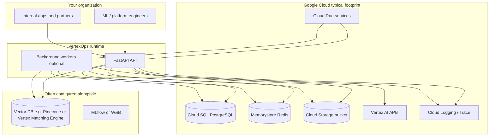
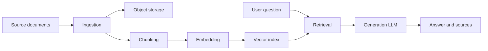
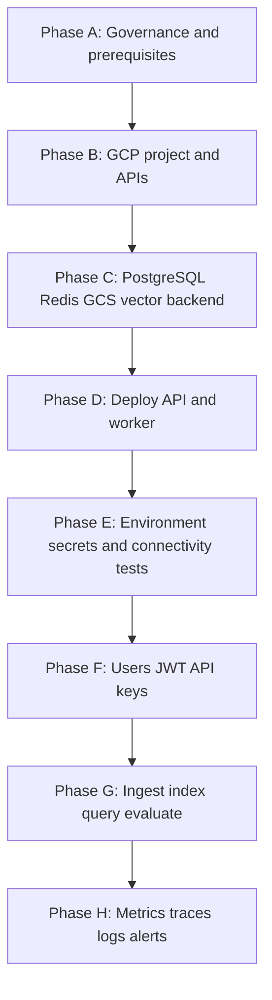
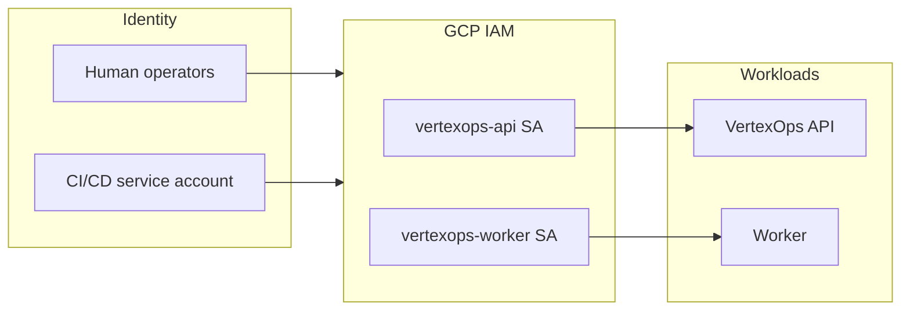
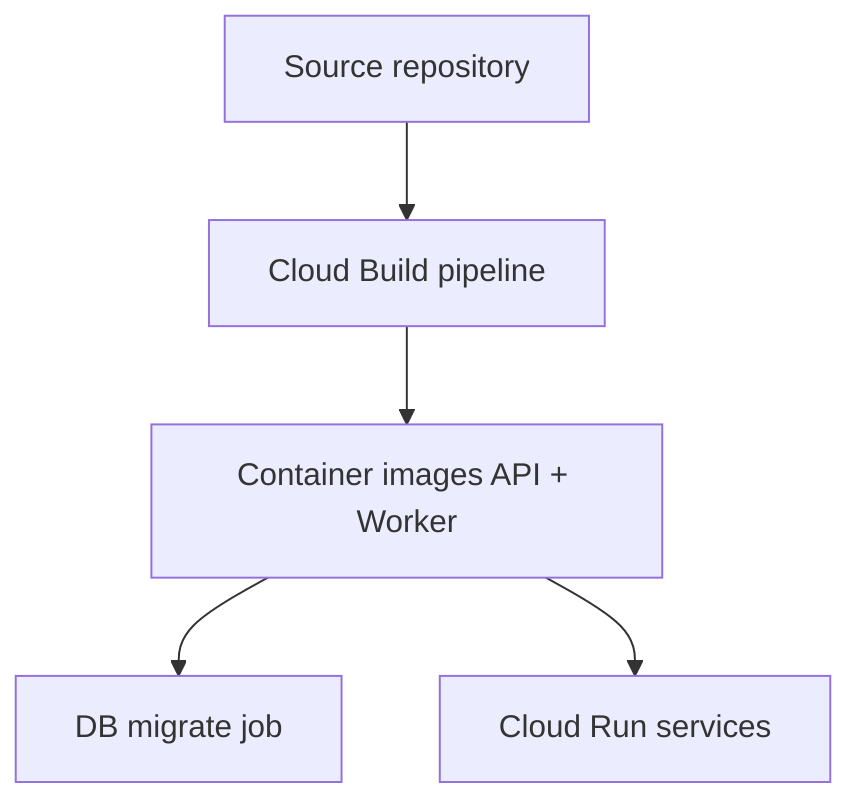
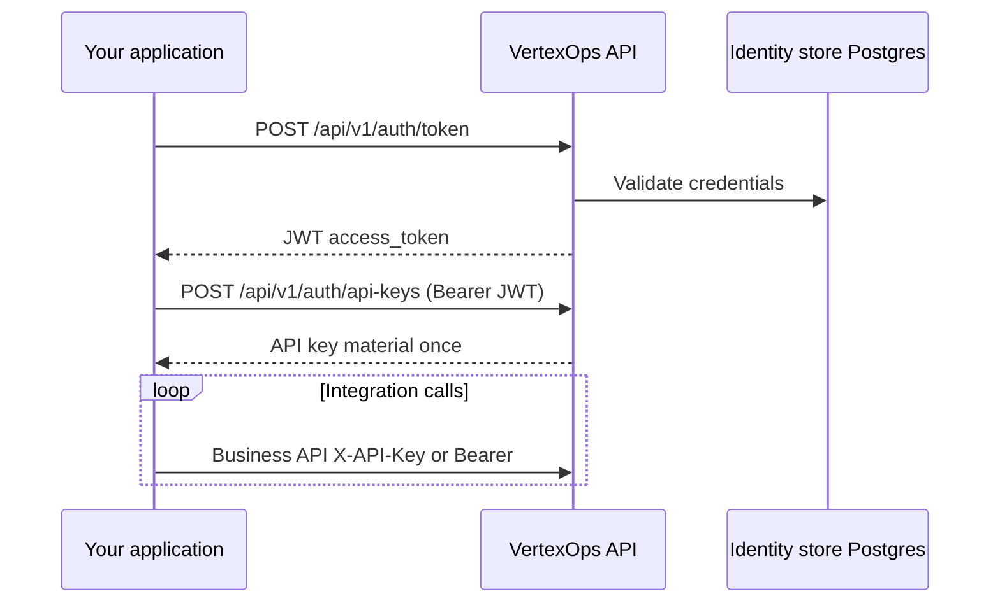

# VertexOps — User & Operator Runbook

**Purpose:** This document explains what **VertexOps** is, how your organization can adopt it, how to connect your **Google Cloud** (and optional supporting) services, and how to operate the platform with a focus on **integration** and **monitoring**. It is written for platform engineers, ML engineers, and security stakeholders who need a clear path from zero to production.

**Related technical references:** [PRD.md](PRD.md), [ARCHITECTURE.md](ARCHITECTURE.md), [API_SPEC.md](API_SPEC.md), [DEPLOYMENT.md](DEPLOYMENT.md), [DB_SCHEMA.md](DB_SCHEMA.md), and [CLAUDE.md](../CLAUDE.md) at the repository root.

---

## Table of contents

1. [What VertexOps does for your company](#1-what-vertexops-does-for-your-company)
2. [How the pieces fit together](#2-how-the-pieces-fit-together)
3. [Roles and responsibilities](#3-roles-and-responsibilities)
4. [Adoption journey at a glance](#4-adoption-journey-at-a-glance)
5. [Phase A — Governance and prerequisites](#5-phase-a--governance-and-prerequisites)
6. [Phase B — Cloud account and project setup (GCP)](#6-phase-b--cloud-account-and-project-setup-gcp)
7. [Phase C — Data plane services your team provisions](#7-phase-c--data-plane-services-your-team-provisions)
8. [Phase D — Deploy VertexOps](#8-phase-d--deploy-vertexops)
9. [Phase E — Configure the application for your cloud](#9-phase-e--configure-the-application-for-your-cloud)
10. [Phase F — Onboard users and API consumers](#10-phase-f--onboard-users-and-api-consumers)
11. [Phase G — Day‑2 workflows (RAG, experiments, evaluation)](#11-phase-g--day2-workflows-rag-experiments-evaluation)
12. [Phase H — Integration and monitoring](#12-phase-h--integration-and-monitoring)
13. [Security and compliance checklist](#13-security-and-compliance-checklist)
14. [Troubleshooting](#14-troubleshooting)
15. [Document map](#15-document-map)

---

## 1. What VertexOps does for your company

VertexOps is an **LLMOps control plane** built around a **FastAPI** service. It helps teams:

| Capability | Business outcome |
|------------|------------------|
| **Document ingestion and indexing** | Turn internal knowledge (PDFs, docs, URLs) into a searchable corpus with lineage. |
| **RAG (retrieval-augmented generation)** | Ground answers in *your* data, with citations and configurable retrieval. |
| **Vector search** | Semantic search over embeddings using a configured vector backend. |
| **Experiments and evaluation** | Compare chunking, embedding, and retrieval strategies with measurable metrics. |
| **Deployment-oriented packaging** | Run the same stack locally, in Docker, or on **GCP Cloud Run** with workers for background jobs. |
| **Observability hooks** | Health checks, optional **Prometheus** metrics, **OpenTelemetry** traces, and structured logs. |

**Important framing:** VertexOps does not replace your cloud provider. It **runs in** your environment and **calls** your managed services (database, cache, object storage, LLM/embedding APIs, vector store) using configuration and credentials you supply.

---

## 2. How the pieces fit together

The following diagram shows the **logical** relationships between people, VertexOps, and your cloud services.

**End-to-end RAG data path** (what happens when you index and query):

---

## 3. Roles and responsibilities

| Role | Typical tasks in a VertexOps rollout |
|------|--------------------------------------|
| **Cloud admin** | GCP project, billing, APIs, IAM service accounts, Secret Manager, networking (VPC connectors if used), Cloud SQL / Redis provisioning. |
| **Security / compliance** | Secret rotation, least-privilege IAM, audit requirements, data residency, access reviews for API keys. |
| **ML or AI platform lead** | Index design, chunking and embedding choices, evaluation datasets, promotion of configs to production. |
| **Application owners** | Integrate line-of-business systems via REST; define SLAs and alerting thresholds. |
| **DevOps / SRE** | Deployments, migrations, health checks, Prometheus scraping, log-based alerts, incident response. |

---

## 4. Adoption journey at a glance

Use this as a **sequenced checklist**. Details for each phase follow in later sections.

| Phase | Outcome |
|-------|---------|
| **A** | Agreed scope, owners, environments (dev/staging/prod), naming conventions. |
| **B** | GCP project ready; required APIs enabled; deployment identities exist. |
| **C** | Durable stores reachable from where VertexOps will run. |
| **D** | VertexOps API (and optional worker) deployed; migrations applied. |
| **E** | All environment variables and secrets wired; `/ready` passes in each environment. |
| **F** | First admin user, JWT login, and scoped API keys for integrations. |
| **G** | First corpus indexed; query path validated; optional eval pipeline exercised. |
| **H** | Prometheus (if used), traces, log queries, and alerts aligned to SLOs. |

---

## 5. Phase A — Governance and prerequisites

### 5.1 Decide what “production” means for you

Before touching infrastructure, agree on:

- **Environments:** At minimum `development` and `production`; many teams add `staging` that mirrors production sizing.
- **Regions:** Pick a **Vertex AI region** (for example `us-central1`) and keep dependent resources (Cloud SQL, Redis, GCS bucket default location) consistent with latency and compliance needs.
- **Data classes:** Which documents may be indexed; whether PII is allowed; retention and deletion expectations (see [PRD.md](PRD.md) security themes).

### 5.2 Skills and tools your team should have

- **GCP:** `gcloud` CLI, IAM concepts, Cloud Run, Cloud SQL, Secret Manager.
- **Containers:** Docker (local parity) and your chosen registry (Artifact Registry is the documented default).
- **APIs:** Ability to call REST with Bearer JWT or API keys; OpenAPI at `/openapi.json` when enabled, interactive docs often at `/docs`.

### 5.3 Repository documentation you will reference during rollout

| Document | Use when |
|----------|----------|
| [DEPLOYMENT.md](DEPLOYMENT.md) | Topology, Compose, Cloud Run, env vars, observability. |
| [API_SPEC.md](API_SPEC.md) | Contract-level description of REST resources. |
| [ARCHITECTURE.md](ARCHITECTURE.md) | Layers, async jobs, integration points. |

---

## 6. Phase B — Cloud account and project setup (GCP)

VertexOps is **GCP-first**. Other clouds are optional parity and not the baseline for this runbook.

### 6.1 Create or designate a GCP project

1. Create a dedicated **project** (recommended) or isolate with folders under your org.
2. **Enable billing** and set budgets / alerts.
3. Note the **project ID**; it will appear in configuration as `GCP_PROJECT_ID`.

### 6.2 Enable APIs and bootstrap service accounts

The repository includes a helper script (see [DEPLOYMENT.md](DEPLOYMENT.md) §5.2) that:

- Enables services such as **Vertex AI**, **Cloud Run**, **Cloud Build**, **Secret Manager**, **Artifact Registry**, **Monitoring**, and **Cloud Trace**.
- Creates least-privilege **service accounts** for the API and worker roles used at deploy time.

Run this from a workstation where `gcloud` is authenticated as a project admin, following the exact commands in **DEPLOYMENT.md** so versioned scripts stay the source of truth.

### 6.3 Trust and network model

**Guidance:** Prefer **workload identity** and attached service accounts on Cloud Run over long-lived JSON keys. If CI must use a key, store it as a **GitHub secret** (or equivalent) and rotate regularly.

---

## 7. Phase C — Data plane services your team provisions

VertexOps expects a **PostgreSQL** database for metadata, **Redis** for rate limiting, Celery broker/result backends, and connectivity checks, plus optional **object storage** and **vector** backends depending on your configuration.

### 7.1 PostgreSQL (required for typical deployments)

- Provision **Cloud SQL for PostgreSQL** (or a supported managed Postgres).
- Record the async connection string format expected by the application (see [DEPLOYMENT.md](DEPLOYMENT.md) §2.2 and §4 for `DATABASE_URL`).

### 7.2 Redis (required for full readiness checks and workers)

- Provision **Memorystore** or compatible Redis.
- Set `REDIS_URL`, `REDIS_BROKER_URL`, and `CELERY_RESULT_BACKEND` per [DEPLOYMENT.md](DEPLOYMENT.md) §4.

### 7.3 Object storage (GCS)

- Create a **bucket** for raw documents and artifacts.
- Grant the API/worker service accounts **object read/write** as needed.
- Set `GCS_BUCKET_NAME` and ensure `GCP_PROJECT_ID` / auth align with your deployment method.

### 7.4 Vertex AI and embeddings

- Set `GCP_PROJECT_ID` and `VERTEX_AI_LOCATION`.
- Ensure the runtime service account has **Vertex AI User** (or tighter custom roles per your org policy) for inference and embedding calls you enable.

### 7.5 Vector store

Choose one supported backend and configure its credentials (for example **Pinecone** API key or **Vertex Matching Engine** integration as implemented in your release). The **DEPLOYMENT** topology diagram lists Pinecone or Vertex Matching Engine as common choices.

---

## 8. Phase D — Deploy VertexOps

You can run VertexOps **locally** (for development), via **Docker Compose**, or on **GCP Cloud Run** for production-style hosting. The same API contract applies; only networking and secrets management change.

### 8.1 Local or Compose (learning and integration dev)

**Goals:** Fast feedback for integrators; use synthetic or non-sensitive data.

- Follow [DEPLOYMENT.md](DEPLOYMENT.md) §2: Python environment with `uv`, `docker compose` for Postgres and Redis, optional worker profile.
- Apply migrations (`alembic upgrade head`) and create a bootstrap admin if your process uses one (see DEPLOYMENT §2.3).

### 8.2 Cloud Run (recommended production pattern in this repo)

High-level deploy flow (details and commands are in [DEPLOYMENT.md](DEPLOYMENT.md) §5):

- Build and push images (`api` and `worker` targets from the root `Dockerfile`).
- Run **database migrations** as a controlled job before or alongside rollout.
- Deploy API with **Secret Manager**-backed env for secrets (JWT signing key, DB URL, API key pepper, provider keys).

---

## 9. Phase E — Configure the application for your cloud

### 9.1 Environment variables (conceptual grouping)

Refer to the authoritative table in [DEPLOYMENT.md](DEPLOYMENT.md) §4. Group variables mentally as:

| Group | Examples | Why it matters |
|-------|----------|----------------|
| **Core app** | `APP_ENV`, `LOG_LEVEL` | Behavior and verbosity. |
| **Security** | `JWT_SECRET_KEY`, `API_KEY_PEPPER` | **Required in production**; compromise equals full platform compromise. |
| **Datastores** | `DATABASE_URL`, `REDIS_URL` | Metadata, queues, rate limits. |
| **GCP / AI** | `GCP_PROJECT_ID`, `VERTEX_AI_LOCATION`, `GCS_BUCKET_NAME` | Calls into your cloud AI and storage. |
| **Vector / LLM providers** | Provider-specific keys | Enables embedding, search, and generation. |
| **Observability** | `METRICS_ENABLED`, `OTEL_EXPORTER_OTLP_ENDPOINT` | Integration with Prometheus and Cloud Trace. |

### 9.2 Validate connectivity from the running service

After deployment, verify in order:

1. **Liveness:** `GET /api/v1/health` — process is up.
2. **Readiness:** `GET /api/v1/ready` — database and Redis checks (as implemented) report healthy.

These paths are mounted under the **`/api/v1`** prefix in the current application layout.

### 9.3 Optional metrics endpoint

When `METRICS_ENABLED=true`, Prometheus scrapes **`GET /api/v1/metrics`**. In production, restrict this endpoint to your observability network path (see metrics router behavior in the codebase and [DEPLOYMENT.md](DEPLOYMENT.md) §5.6).

---

## 10. Phase F — Onboard users and API consumers

### 10.1 Human access (dashboard or direct API)

Typical flow:

1. **Register** (if `ALLOW_PUBLIC_SIGNUP` is enabled in your environment) or provision users through your admin process.
2. Obtain a JWT via **`POST /api/v1/auth/token`** with email and password.
3. Call protected routes with header: `Authorization: Bearer <access_token>`.

See [API_SPEC.md](API_SPEC.md) §3 for the canonical auth table.

### 10.2 Machine access (integrations)

For services, cron jobs, or partner systems:

1. Authenticate as a user (or service account–backed technical user, per your policy).
2. Create an **API key** via **`POST /api/v1/auth/api-keys`**.
3. Store the key in the consuming system’s secret store; **rotate** on schedule.

**Note:** Exact API key header naming should match your deployment’s documented convention; [API_SPEC.md](API_SPEC.md) suggests patterns such as `X-API-Key`.

### 10.3 Workspace and multi-team usage

As multi-tenant features evolve, treat **namespaces**, **indexes**, and **experiments** as the isolation boundaries for teams. Align naming (`idx_prod_hr`, `idx_staging_support`) with your change-management process.

---

## 11. Phase G — Day‑2 workflows (RAG, experiments, evaluation)

This section describes **what your teams do** with VertexOps after login—not every endpoint variant (see [API_SPEC.md](API_SPEC.md) for full paths).

### 11.1 Bring documents into the system

1. **Register** uploads or URL ingest jobs per **`POST /api/v1/documents`** (and related upload patterns documented in API_SPEC §5).
2. Monitor document status via **`GET /api/v1/documents/{document_id}`** until processing completes or fails.

### 11.2 Build or refresh an index

1. Create or update an index with chunking and embedding configuration (**`/api/v1/indexes`** family).
2. For large corpora, expect **async** work handled by workers; poll index status endpoints.

### 11.3 Query with RAG

1. Call **`POST /api/v1/query`** (and related query endpoints as implemented) with `question`, `index_id`, `top_k`, and optional metadata **filters**.
2. Review **sources** in the response for grounding quality before promoting to wider audiences.

### 11.4 Experiments and evaluation

1. Register an **experiment** with a config payload.
2. Trigger runs that tie together ingest, indexing, and optional evaluation.
3. Compare metrics across runs; optionally connect **MLflow** or Weights & Biases when enabled in configuration.

---

## 12. Phase H — Integration and monitoring

### 12.1 What to monitor

| Signal | Where | Suggested use |
|--------|-------|---------------|
| **HTTP availability** | Synthetic checks against `/api/v1/health` | Paging when completely down. |
| **Dependency health** | `/api/v1/ready` | Early warning for DB/Redis outages. |
| **Golden path latency** | Traces + app-reported `latency_ms` on query responses | SLO tracking on RAG path. |
| **Error rate** | Logs and metrics | Alert when error ratio exceeds policy (example threshold in DEPLOYMENT checklist: >1%). |
| **Saturation** | Cloud Run CPU/memory, Redis, DB connections | Capacity planning. |
| **Cost** | Vertex AI usage, embedding volume, storage growth | FinOps review tied to indexes and experiments. |

### 12.2 Prometheus (optional but recommended for Kubernetes-style ops)

1. Set `METRICS_ENABLED=true` in the API service environment.
2. Configure your **Prometheus** scrape job to pull **`/api/v1/metrics`** on a private network path.
3. Build Grafana dashboards for request rate, latency histograms, and dependency errors.

### 12.3 OpenTelemetry and Cloud Trace

1. Set `OTEL_EXPORTER_OTLP_ENDPOINT` to your collector endpoint (GCP-hosted or other).
2. Ensure outbound connectivity from Cloud Run (VPC connector if required by your network policy).
3. Use trace IDs in support workflows to correlate API logs and worker logs.

### 12.4 Logs

VertexOps emits **structured JSON logs** to stdout. On Cloud Run, **Cloud Logging** ingests these automatically. Define saved queries for:

- Authentication failures (possible abuse).
- Ingestion and index rebuild failures.
- Repeated retrieval misses or timeout patterns.

### 12.5 Operational checklist (pre-go-live)

Mirror and extend the checklist in [DEPLOYMENT.md](DEPLOYMENT.md) §8:

- [ ] Migrations applied in target environment.
- [ ] `JWT_SECRET_KEY` and `API_KEY_PEPPER` are production-grade and stored in Secret Manager.
- [ ] `/api/v1/ready` succeeds under expected load test.
- [ ] Index namespace/version strategy documented.
- [ ] Metrics and/or traces enabled per observability design.
- [ ] Backups configured for PostgreSQL and object storage.
- [ ] Alerts for error rate and tail latency configured.

---

## 13. Security and compliance checklist

Use this alongside your internal security standards:

- **Secrets:** Never commit `.env` files; use Secret Manager or equivalent in production.
- **Least privilege:** Separate deploy identities from runtime service accounts; scope GCS and Vertex permissions narrowly.
- **Transport:** TLS everywhere for client-to-API traffic; private connectivity where policy requires.
- **API keys:** Treat as passwords; rotate; revoke on employee offboarding for technical users.
- **Data handling:** Classify indexed content; apply retention and deletion procedures (GDPR-style expectations are outlined at product level in [PRD.md](PRD.md) and [CLAUDE.md](../CLAUDE.md)).
- **Rate limits:** Stricter tiers for ingest, rebuild, eval, and high-volume query per [API_SPEC.md](API_SPEC.md) §1.5.

---

## 14. Troubleshooting

| Symptom | Likely cause | What to check |
|---------|--------------|---------------|
| `ready` shows database unreachable | Wrong `DATABASE_URL`, network, or Cloud SQL auth | Connection string, VPC connector, IAM DB auth if used. |
| Redis unreachable in `ready` | Wrong `REDIS_URL` or private IP access | Memorystore VPC, firewall, URL format. |
| Embeddings or Vertex calls fail | Missing APIs, IAM, or wrong region | `VERTEX_AI_LOCATION`, service account roles, quota. |
| Vector upsert/search errors | Wrong index or API key | Provider dashboard, namespace spelling. |
| Metrics 404 | `METRICS_ENABLED=false` | Toggle env and redeploy. |
| Integrations get 401/403 | Expired JWT or missing scope | Token lifetime, API key revocation. |

Always capture **request ID / trace ID** from logs when opening incidents.

---

## 15. Document map

| Need | Read |
|------|------|
| Product scope and requirements | [PRD.md](PRD.md) |
| System layers and async jobs | [ARCHITECTURE.md](ARCHITECTURE.md) |
| REST contracts | [API_SPEC.md](API_SPEC.md) |
| Tables and relationships | [DB_SCHEMA.md](DB_SCHEMA.md) |
| Install, Compose, Cloud Run, CI/CD | [DEPLOYMENT.md](DEPLOYMENT.md) |
| Full platform specification | [CLAUDE.md](../CLAUDE.md) |
| Repository quick start | [README.md](../README.md) |

---

**Document version:** 1.0  
**Last updated:** April 2026  
**Maintained with:** VertexOps documentation set
